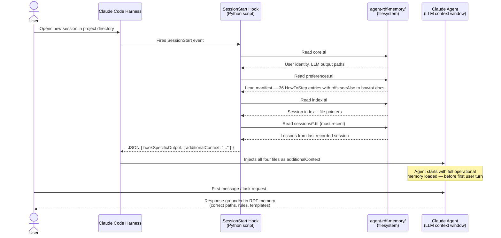

# Automatic RDF Memory Loading via SessionStart Hook

## How It Works

## Problem

Claude Code agents in this project were ignoring the authoritative `agent-rdf-memory/` system and instead operating from the auto-injected `MEMORY.md`. This caused recurring failures: wrong output directories, missed harness contract requirements, and template reuse rules being skipped — documented across multiple sessions (DeepSeek V4 Pro, Claude Sonnet 4.6).

Click [HERE](https://mermaid.live/edit#pako:eNp1VMtu2zAQ_JUFT0kr25KfsVAEKBQYaZFHEbWXwhdGWtlsJFIlqTqqYaAf0S_sl3QpGoabuL5ZnJndnR1yyzKVI4uZwe8NygyvBF9pXi0l0I9nVmn4YlD7_zXXVmSi5tJCkgA3kJS8yRESEoFrriUa8xp6rdSTA6d0KpRMLZ11H9896sHl2afWrpUEk2lR2_PX9EXqyHyF0vZ0XvQqrJRuB55ciBJNayxWJ5i31FZ51OZ7p-F5Nze3kClp8dnCRshcbYjvFdy8vcvLJInhvkZpQOIGjO8dhIRaq2-YWciFRmdQ62lJQiQ3VQwLOnkxLv6g0h7oMARdpDE8IM-pDY19a0t_ukh7Bx3XCYicmMK2AbieVWPrxtKUdm1Oy9UaC9Rul-a0ajQjzuazSi3WoGrU3FKbvATdkJenRckhfD4tlx6cIQi8BbcRqJUgb_V_1PZmmsEbJwlnlTIWyEwa9Px1gRtCExgKrSoouYcqneNB6KjKfnEf0_s72MKaPqU1ZqIQ2X3nXExfeZ4LP3LiExDDkvX7_SWDHeyOttnlJ4YP0u2bIliWUKhGdyOaLpQvlTz5TlkE9YOWt1foggfGJcFQ3OwaiobEjszvUumTDaXibrg_v37DIxaUDiqoaezGxcE2-t-c7kssOkhFhtBNgQFYbp7IKLrVZt9VB3QGOaLbhKnJVoSVVo10BSnbD1cL8F34a0I-u5D7vAU-IQHQbatLbtGcs4BVqCsucnpDtq7Oktk1VrhkztQcC96UdsmWckdQ3liVtjJjsdUNBqypc1LZPzksLnhp6CtdXRZv2TOLe_P-fBoOx7OLMIzG0XQ2CljL4vGoP5rMw3A0DWfjYRTOdgH7qRQpRP0omg2j-TAMp5Ph5GIy7eS-doe-Jg27Wh9qIe1P6Vv_BnZPISGQ3NAJmWJZPL0YB2yl3XyOv_sLcXq6ew) for live diagram.

## Solution

A `SessionStart` hook configured in `.claude/settings.json` reads the RDF memory files at the start of every new session and injects them as `additionalContext` into the model — no explicit instruction needed.

## What the Hook Does

On every session start, the hook runs a Python script that reads:

1. `agent-rdf-memory/core.ttl` — user identity, output path routing per LLM
2. `agent-rdf-memory/preferences.ttl` — lean manifest of all 36 operational rules (HowToSteps). Each step carries only `schema:position`, `schema:name`, `onto:hasTrigger` (where applicable), and `rdfs:seeAlso <howto/X.ttl>`. The full step text lives in 9 thematic howto docs under `agent-rdf-memory/howto/`, grouped by topic:
   - `session-governance.ttl` — approval, memory protocol, git, no-fabricated-URLs, curl auth, secret redaction, prompt recording
   - `artifact-routing.ttl` — output dirs, GPT-5 dirs, mashup/meshup, default output root
   - `skill-invocation.ttl` — skill chain, KG query mode, ZIP repackage, retrieval tool order
   - `infographic-authoring.ttl` — attribution, dark mode CSS, KG Explorer reuse, template selection
   - `harness-contract-compliance.ttl` — harness IDs, footer labels, SPARQL format, ERE workaround
   - `kg-explorer-ui-patterns.ttl` — nav placement, collapsed start, master close, orphans, toolbar groups, settings panel
   - `kg-explorer-d3-patterns.ttl` — simulation lifecycle, click guard, kgData regex
   - `rdf-document-authoring.ttl` — document entity declaration, schema:about usage
   - `agent-identity.ttl` — whoami format, Stripe sandbox card
3. `agent-rdf-memory/index.ttl` — session index with pointers to all past session files
4. The most recent session `.ttl` file — lessons learned from the last recorded session

The combined content is returned as `additionalContext`, making it part of the model's context window from the first turn. Agents follow `rdfs:seeAlso` into the relevant howto doc on demand for full step details.

## Files Changed

| File | Change |
|------|--------|
| `.claude/settings.json` | Created — contains the `SessionStart` hook |

## Activation

The hook is project-scoped and fires automatically for any new Claude Code session opened in this directory. To reload config in an already-running session, open `/hooks` in the Claude Code UI.

## Why Not CLAUDE.md or MEMORY.md?

- `CLAUDE.md` contains the *instruction* to read `agent-rdf-memory/` but relies on the agent following it — which has proven unreliable across multiple LLMs.
- `MEMORY.md` is auto-injected but only contains a summary index, not the operational rules.
- The hook enforces the protocol structurally: the memory files are loaded before the agent generates any response, regardless of what it "remembers" to do.
