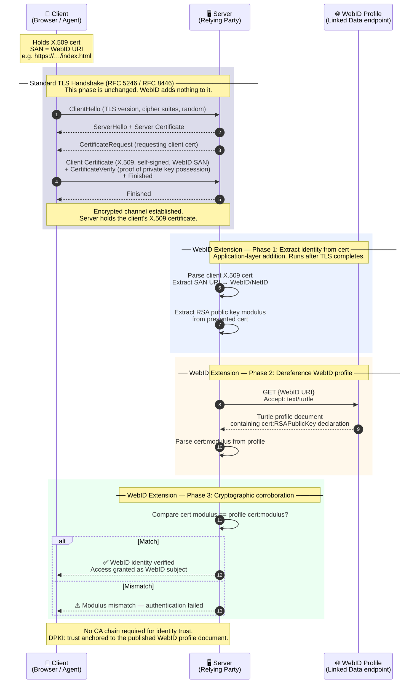
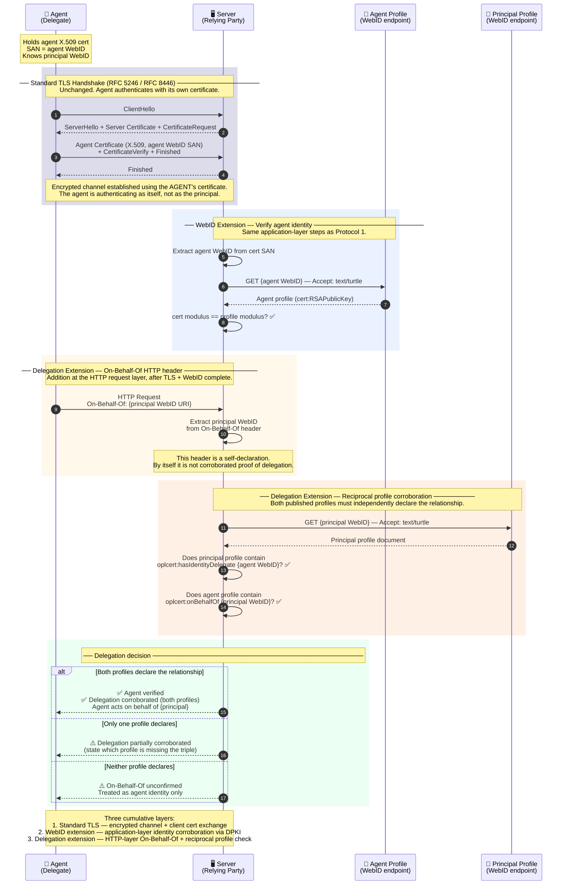

# YouID Skill

Generate, verify, and manage Web-scale verifiable digital identities (NetIDs) using semantic web standards — self-signed X.509 certificates, WebID profile documents (Turtle, JSON-LD, RDFa HTML), identity card HTML pages, vCard VCF, and complete linked-data identity bundles.

→ Full specification: [SKILL.md](SKILL.md)  
→ Usage prompts: [examples/README.md](examples/README.md)

---

## Protocol Flows

The diagrams below illustrate the two core authentication protocols that YouID credentials participate in.

**Important framing:** Both protocols are **additions to a standard TLS handshake** — not replacements for it. The standard TLS handshake (RFC 5246 / RFC 8446) completes first, establishing an encrypted channel and optionally authenticating the client via X.509 certificate (mTLS). WebID+TLS and WebID+TLS+Delegation then add **application-layer verification steps** on top of that completed handshake. The TLS layer itself is unchanged.

The additional steps are grounded in **Decentralised Public Key Infrastructure (DPKI)**: the X.509 certificate carries the identity URI (WebID/NetID) in its Subject Alternative Name (SAN), so identity trust is anchored to the published profile document rather than a central Certificate Authority hierarchy.

---

### 1 — WebID+TLS (Basic mTLS + WebID Application Layer)

Standard TLS with client authentication (mTLS) completes first. The WebID extension then adds an application-layer step: the server extracts the WebID URI from the certificate's SAN, dereferences it to fetch the published profile document, and compares the certificate's RSA public key modulus against the `cert:RSAPublicKey` declared in that profile. Match = verified identity, no CA required.

**What is added on top of standard TLS:**
- The server **reads the SAN** from the already-presented client certificate (Phase 1) — the cert was already exchanged during the standard handshake
- The server **dereferences the SAN URI** to fetch the published WebID profile (Phase 2) — an HTTP GET that happens at the application layer
- The server **compares moduli** to confirm the cert matches the published identity (Phase 3) — a cryptographic check at the application layer

---

### 2 — WebID+TLS+Delegation (mTLS + WebID Application Layer + On-Behalf-Of)

Standard TLS with client authentication completes first (same as Protocol 1). The WebID extension then verifies the agent's identity. A further delegation layer is then added at the HTTP request level: the agent includes an `On-Behalf-Of` header declaring the principal it acts for, and the server performs a **reciprocal corroboration check** against both parties' published profiles. All three layers are cumulative.

**What is added on top of standard TLS:**
- **WebID extension** (same as Protocol 1): SAN extraction → profile dereference → modulus comparison
- **`On-Behalf-Of` HTTP header** (delegation layer 1): the agent self-declares the principal it represents — added at the HTTP request layer, not the TLS layer
- **Reciprocal profile corroboration** (delegation layer 2): the server independently checks both published profiles for matching triples — neither party can fake this without controlling the other's profile document

**Why the header alone is insufficient:** the `On-Behalf-Of` header is a self-declaration. A well-behaved relying party must confirm the corroborating triples in both profiles before treating the delegation as authorised. Skipping this step cannot distinguish authorised delegation from impersonation.

---

## Credential Bundle Structure

A YouID credential bundle (generated by `scripts/generate_identity.sh`) contains all representations needed to participate in both protocols:

| File | Role in protocol |
|------|-----------------|
| `cert.pem` / `cert.p12` | X.509 certificate — presented in TLS ClientHello (standard handshake) |
| `profile.ttl` | Published WebID profile — `cert:RSAPublicKey` for modulus check (WebID extension) |
| `profile.jsonld` | JSON-LD equivalent of profile.ttl |
| `profile_rdfa.html` | RDFa HTML equivalent — human-readable + machine-readable |
| `index.html` | Identity card — POSH + embedded JSON-LD + embedded Turtle + hidden RDFa |
| `public_key.ttl` | Standalone public key document |
| `certificate.ttl` | Standalone certificate metadata |
| `vcard.vcf` | vCard for address book import |

For delegation, `profile.ttl` and `index.html` must additionally carry:

| Party | Triple | File(s) |
|-------|--------|---------|
| Delegator (principal) | `oplcert:hasIdentityDelegate <delegate-webid>` | `profile.ttl`, `profile.jsonld`, `profile_rdfa.html`, `index.html` |
| Delegate (agent) | `oplcert:onBehalfOf <delegator-webid>` | `profile.ttl`, `profile.jsonld`, `profile_rdfa.html`, `index.html` |

See [SKILL.md § T6](SKILL.md) for the delegation workflow.
